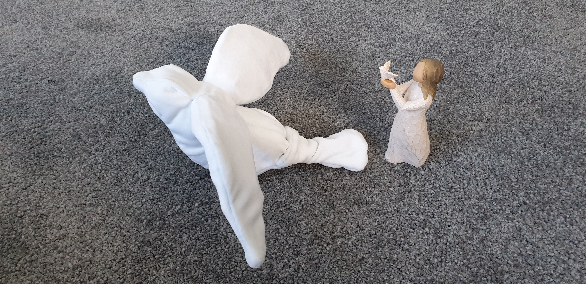
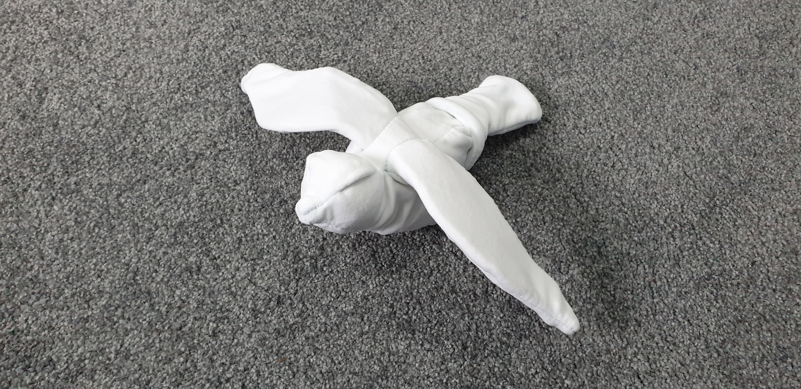
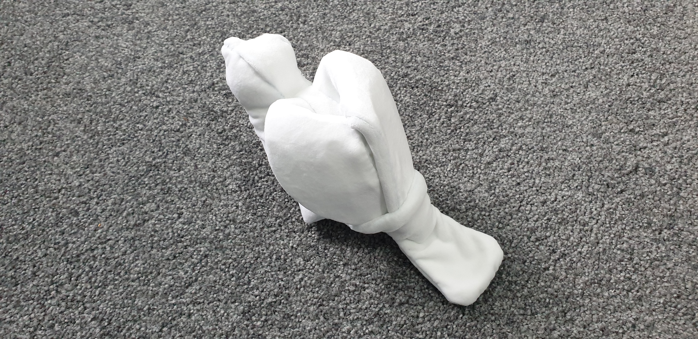

# 🕊️ Dove Stencil

<!--  -->

<!--  -->

<!--  -->

More photos are in the [photos](photos/) directory.

### Notes

* Make sure the fabric you have is at least 62 cm x 46 cm.
* Get velour fleece from [neotrims.com](https://neotrims.com/product/velour-fleece-fabric-stretch-anti-pill-quality-28-colours-neotrims/).
* For drawing on fabric, use chalk, not a marker (which just slides on the fabric). [Birch Creative Chaco Pen Blue](https://www.spotlightstores.com/nz/sewing-fabrics/quilting/quilting-tools/birch-creative-chaco-pen/80426706) works.
